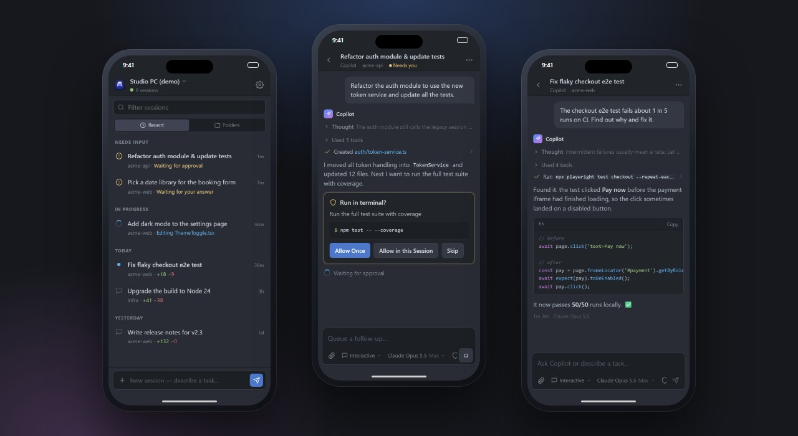
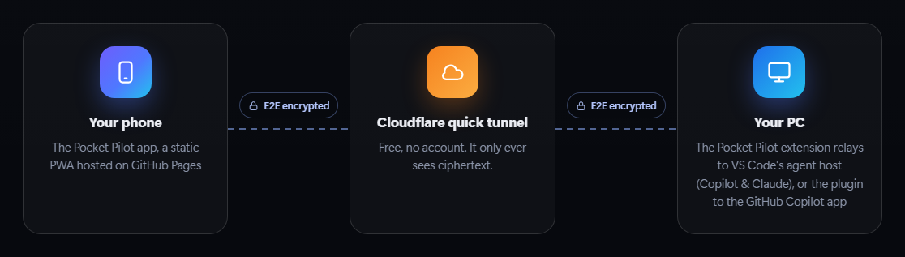

# Pocket Pilot

**Your Copilot agents, in your pocket.** Chat with your GitHub Copilot and Claude agent sessions — in VS Code, the GitHub Copilot app or the Copilot CLI — approve their tool calls and get notified when they need you, from your phone, anywhere. Free, end-to-end encrypted, passkey-protected, no servers.

**[Product page](https://mithawala.github.io/pocket-pilot/) · [Live demo](https://mithawala.github.io/pocket-pilot/app/?demo) · [Download the extension](https://github.com/mithawala/pocket-pilot/releases/latest/download/pocket-pilot.vsix) · [Plugin for the GitHub Copilot app](#github-copilot-app-and-cli)**

<p align="center"></p>

- **Same sessions, same history.** The phone app is a real client of VS Code's *Agent Host Protocol*: you see exactly the sessions and full history VS Code shows, live, token by token.
- **Feels like VS Code.** Atom One Dark (or One Light) theme, VS Code-style chat input with the mode and model pickers under the text, compact tool progress rows, the same confirmation buttons, and syntax-highlighted code. Browse sessions by recency or grouped by folder with their `+added −removed` line counts, like VS Code's Agents window.
- **Everything you can do at your desk.** Send messages, queue follow-ups, steer a running agent, stop it, approve or skip tool calls (with the same options VS Code offers), answer the agent's questions, pick the model with its thinking level and context size, switch mode (Interactive / Plan / Autopilot) and approvals, start new sessions in any folder, send photos and files.
- **Also for the GitHub Copilot app and CLI.** A Copilot plugin gives the same phone app to the sessions you run in the GitHub Copilot desktop app or the Copilot CLI — [see below](#github-copilot-app-and-cli).
- **Push notifications** when an agent needs approval, asks a question, finishes or fails — sent directly from your PC with standard Web Push (no Firebase, no account).
- **Secure by design:** QR pairing with approval on your PC, per-device keys that can't be exported, Face ID / fingerprint (passkeys), end-to-end encryption through the tunnel, instant revocation.
- **Free:** Cloudflare quick tunnel (no account) + a static PWA on GitHub Pages. Your GitHub token never leaves your PC.

## How it works

<p align="center"></p>

1. VS Code (1.133+) runs agent sessions in its **agent host** and publishes a local, token-protected endpoint for the [Agent Host Protocol](https://github.com/microsoft/agent-host-protocol) (AHP).
2. The extension runs a small **relay** on `127.0.0.1` and exposes it through a free **Cloudflare quick tunnel** (`cloudflared` is downloaded once from the official GitHub release and checksum-verified).
3. The **PWA** (static, hosted on GitHub Pages) pairs with the relay by scanning a QR code, then speaks AHP to the agent host *inside* an end-to-end encrypted channel. The relay only forwards an allow-listed set of AHP methods and pushes your GitHub token to the agent host itself.
4. The extension's **monitor** watches session status and sends **Web Push** notifications ("needs you", "finished", "error") straight to the browser vendor's push service.
5. Quick-tunnel URLs change when VS Code restarts: the extension keeps the current URL in a **secret GitHub gist, encrypted** with a key only paired phones know, so phones reconnect automatically.

## Security model

| Layer | What it does |
|---|---|
| Pairing | The QR code carries a single-use 128-bit token (expires in 10 min) and the PC's key fingerprint. The token only lives in the URL fragment (never sent to any server) and is removed from the address bar immediately. VS Code asks you to **approve** every new phone. |
| Device identity | Each phone generates an ECDH P-256 key pair; the private key is **non-extractable** (WebCrypto) and stored in IndexedDB. The PC stores only public keys. |
| Handshake | `ECDH(device, PC)` + ephemeral `ECDH` (forward secrecy) + pairing token → HKDF-SHA-256 → per-direction AES-256-GCM keys. Mutual authentication: a party without the right private key cannot produce a single valid frame. The phone pins the PC's key (fingerprint shown during pairing). |
| Transport | Every frame is AES-256-GCM encrypted with a strict sequence number (no replay, reordering or drops). Cloudflare only sees ciphertext. |
| Biometrics | Phones register a **passkey** (Face ID / Touch ID / fingerprint / screen lock) at pairing. The extension verifies WebAuthn assertions itself (ES256/RS256, user-verification required, origin/rpId/challenge/counter checks) and asks again after the grace period (default 12 h). |
| Least privilege | The relay allow-lists AHP methods (no file writes, no terminals, no `authenticate` from the phone); file reads are limited to your session folders. The agent host connection token and your GitHub token never leave the PC. |
| Control | See and remove paired phones in the VS Code sidebar (they're disconnected instantly). *Reset identity* invalidates every pairing. Failed attempts are rate-limited per IP. |
| Push | Web Push payloads are encrypted for the device (RFC 8291) and signed with VAPID (RFC 8292); only real push services are accepted as endpoints. |

## Get started

1. **Install the extension**: download [`pocket-pilot.vsix`](https://github.com/mithawala/pocket-pilot/releases/latest/download/pocket-pilot.vsix) from the [latest release](https://github.com/mithawala/pocket-pilot/releases/latest), then *Extensions → … → Install from VSIX* (or `code --install-extension pocket-pilot.vsix`).
2. Open the **Pocket Pilot** view in the activity bar and click **Start remote access**. The first time, VS Code asks to:
   - let Pocket Pilot use your GitHub account (so phone requests are authenticated to the agent host),
   - download `cloudflared` (~55 MB, verified),
   - optionally enable auto-reconnect (secret gist).
3. **Scan the QR code** with your phone's camera. Check that the fingerprint matches, tap **Pair securely**, click **Allow** in VS Code and confirm with Face ID / fingerprint.
4. Tap **Enable notifications**.
   - **iPhone:** notifications require the app on your Home Screen — in Safari tap **Share → Add to Home Screen**, then open Pocket Pilot from there and enable notifications.
   - **Android:** tap **Install** (or Chrome menu → *Add to Home screen*) for an app-like experience; notifications work in the browser too.

The phone app lives at **https://mithawala.github.io/pocket-pilot/app/** — try it without pairing at [`/app/?demo`](https://mithawala.github.io/pocket-pilot/app/?demo). The product page is **https://mithawala.github.io/pocket-pilot/**.

## GitHub Copilot app and CLI

The **Pocket Pilot plugin** brings the same phone app to the sessions you run in the GitHub Copilot app (desktop) and the Copilot CLI. It's an [Agent Plugins](https://agent-plugins.org) package in [`copilot-plugin/`](copilot-plugin/) with a Copilot [extension](https://docs.github.com/en/copilot/how-tos/copilot-cli/customize-copilot/plugins-creating), and this repository is its marketplace.

1. **Install it** in a terminal (the GitHub Copilot app uses the same plugins — restart the app afterwards):

   ```bash
   copilot plugin marketplace add mithawala/pocket-pilot
   copilot plugin install pocket-pilot@pocket-pilot
   ```

2. In any chat in the GitHub Copilot app (or the CLI), type **`/pocket-pilot`** — or just ask *"pair my phone"*. Confirm, and a page with a QR code opens in your browser (the CLI also prints it). The first time, `cloudflared` (~55 MB, checksum-verified) is downloaded.
3. **Scan the QR code**, check the fingerprint, tap **Pair securely**, click **Allow** on the page (or in the chat) and confirm with Face ID / fingerprint. Tap **Enable notifications**.

Your phone now shows every chat you use in the app or the CLI — with the full history, replies streaming live, and the same actions: chat, queue and steer, approve or deny tool calls, answer questions, approve plans, switch model, mode and approvals, stop the agent, send photos and files, and push notifications. `/pocket-pilot status` shows the tunnel and paired phones, `/pocket-pilot off` closes the tunnel.

**How it works.** The Copilot runtime starts the plugin's extension in every session. The first chat you use hosts a small hub — the same end-to-end encrypted relay, Cloudflare quick tunnel, pairing, passkeys and Web Push as the VS Code extension — and the other chats connect to it on `127.0.0.1`. The hub translates each session's runtime events into the Agent Host Protocol, so the phone app renders them exactly like VS Code sessions, and it answers approvals and questions through the runtime's own APIs: whichever of the PC or the phone answers first wins. State lives in `~/.pocket-pilot/copilot/` (keys, paired phones; files readable only by you).

**Good to know.**

- A chat appears on the phone once it has a message; start new chats on the PC.
- If the chat that hosts the hub closes, another open chat takes over with a new tunnel address. With the GitHub CLI signed in (`gh auth login`, a personal account — work accounts with Enterprise Managed Users can't own gists), the address is kept in an encrypted secret gist and phones reconnect on their own; otherwise run `/pocket-pilot` and scan again.
- In VS Code the plugin stays out of the way: VS Code's sessions are served by the VS Code extension.
- Remove a phone on the pairing page (`/pocket-pilot`) — it's disconnected at once.

## Settings

| Setting | Default | Description |
|---|---|---|
| `pocketPilot.autoStart` | `true` | Start remote access when VS Code starts (after you started it once). |
| `pocketPilot.pwaUrl` | `https://mithawala.github.io/pocket-pilot/app/` | Where the phone app is hosted (the QR code opens it). |
| `pocketPilot.tunnel.mode` | `quick` | `quick` (Cloudflare, free), `custom` (your own HTTPS URL: named Cloudflare tunnel, dev tunnel, Tailscale Funnel…), `none`. |
| `pocketPilot.tunnel.customUrl` | | Public URL for `custom` mode (set `pocketPilot.port` too). |
| `pocketPilot.security.requireApproval` | `true` | Confirm new phones in VS Code. |
| `pocketPilot.security.passkey` | `required` | `required`, `optional` or `off`. |
| `pocketPilot.security.passkeyGraceHours` | `12` | Re-verify Face ID / fingerprint after this long (0 = every connection). |
| `pocketPilot.security.pairingCodeMinutes` | `10` | QR code lifetime (single use). |
| `pocketPilot.rendezvous.enabled` | `true` | Encrypted secret gist for automatic reconnection. |
| `pocketPilot.notifications.*` | `true` | `inputNeeded`, `finished`, `errors`, `skipWhileActive`. |
| `pocketPilot.uploads.folder` | `.pocket-pilot/uploads` | Where files sent from the phone are saved (git-ignored). |

## FAQ

- **How is this different from Copilot's built-in `/remote`?** GitHub's remote control (`/remote on`, `copilot --remote`) streams a Copilot CLI session to GitHub.com and the GitHub Mobile app. It's official and covers the terminal, VS Code and JetBrains. Pocket Pilot connects your phone straight to VS Code: every agent session shows up without switching it on (Claude sessions too), you can start new sessions on your PC from your phone, and the link is end-to-end encrypted with no copy of the session in a cloud. See [the comparison below](#pocket-pilot-vs-copilot-remote-control-remote).
- **Which sessions show up?** Every session hosted by VS Code's agent host — Copilot CLI and Claude agent sessions, across all VS Code windows. (Classic, non-agent-host chat panel sessions are not part of the protocol.) With the [plugin](#github-copilot-app-and-cli), also the chats you use in the GitHub Copilot app and the Copilot CLI.
- **Does it work with the GitHub Copilot app?** Yes — install the [Pocket Pilot plugin](#github-copilot-app-and-cli) and type `/pocket-pilot` in a chat. Pair the app and VS Code separately; the phone app switches between them like between two PCs.
- **Does my PC have to stay on?** Yes — VS Code (or the GitHub Copilot app / CLI) must be running and the PC awake.
- **Tunnel doesn't start on a corporate network?** Quick tunnels need outbound TCP/UDP 7844. Use `tunnel.mode: custom` with a tunnel your network allows.
- **Multiple VS Code windows?** One window hosts the relay; if it closes, another takes over automatically (phones reconnect).
- **Lost phone?** Remove it in the Pocket Pilot panel (instant), or run *Pocket Pilot: Reset Identity*.

## Pocket Pilot vs. Copilot remote control (`/remote`)

GitHub Copilot has built-in remote control: `/remote on` (or `copilot --remote`) streams a Copilot CLI session to GitHub.com and the GitHub Mobile app, where you can follow it and steer it. It's a good, official option. Here's how the two differ.

| | Copilot remote control (`/remote`) | Pocket Pilot |
|---|---|---|
| **Made by** | GitHub; official and supported. | An independent open-source project, in preview. |
| **Where you use it** | The GitHub Mobile app and github.com. | An installable web app on iPhone and Android, with a desktop layout in any browser. |
| **Which sessions** | Copilot CLI sessions, started in the terminal, VS Code or JetBrains. | Every session in VS Code's agent host, including Claude sessions — and, with the plugin, the chats in the GitHub Copilot app and CLI. |
| **Turning it on** | Per session with `/remote on` or `copilot --remote` (the CLI can default to it with `"remoteSessions": true`). VS Code also needs the `github.copilot.chat.cli.remote.enabled` setting, and its docs list a workspace that maps to a GitHub repository. | Pair your phone once. All sessions show up, including ones you start later. |
| **Starting new work from your phone** | Steers sessions already running on your machine. New work started from GitHub Mobile runs as a cloud agent on GitHub. | Starts new sessions on your own PC: pick the folder, model, mode, approvals and an optional new worktree. |
| **Inside a session** | Live progress, steering and queued messages, approvals, questions, plan review, switching modes, stopping. | The same, plus the model with its thinking level and context size, photo and file attachments, and previews of files the agent links to. |
| **Notifications** | Live activities (iOS) and live updates (Android) in GitHub Mobile. | Web Push sent from your PC when an agent needs you, finishes or fails. |
| **Where your session goes** | Session events are sent to GitHub and synced to your GitHub account, where only you can see them. | Straight from your phone to your PC, end-to-end encrypted. The tunnel only relays ciphertext and nothing is stored in a cloud. |
| **Signing in** | Your GitHub account. | Pairing you approve in VS Code, plus a passkey (Face ID or fingerprint). No GitHub sign-in on the phone. |
| **Work accounts** | For Copilot Business and Enterprise, an admin must set the "Store local sessions in the Cloud" policy to "View and control". | Nothing to switch on at GitHub, but your company's policies still apply. |
| **Network** | Your machine connects out to GitHub. | A Cloudflare quick tunnel (outbound port 7844), or a tunnel you choose. |
| **Cost** | Included with Copilot. | Free and open source (MIT). |

**Choose `/remote` when** your organization provides it and you want the officially supported route, you also run Copilot in JetBrains, you want everything in GitHub Mobile next to cloud agent sessions and pull requests you can review and merge, or your network doesn't allow tunnels.

**Choose Pocket Pilot when** you want every VS Code agent session on your phone without switching each one on, you want to start new sessions on your own PC from your phone, you use Claude sessions in VS Code, you want the phone link end-to-end encrypted with no copy of the session in a cloud, or you want model, thinking level and context size controls or a desktop browser layout.

They work side by side: a session with `/remote on` still shows up in Pocket Pilot. Either way, your prompts go to the AI model exactly as they do in VS Code; what differs is how your phone reaches the session. If your organization has turned remote control off, check with them before using Pocket Pilot for work. It isn't a way around company policy.

Sources: GitHub Docs, [About remote control of Copilot CLI sessions](https://docs.github.com/en/copilot/concepts/agents/copilot-cli/about-remote-control) and [Steering a Copilot CLI session from another device](https://docs.github.com/en/copilot/how-tos/copilot-cli/use-copilot-cli/steer-remotely); GitHub Changelog, [remote control generally available](https://github.blog/changelog/2026-05-18-remote-control-for-copilot-cli-sessions-now-generally-available-on-mobile-web-and-vs-code/) and [GitHub Mobile live notifications](https://github.blog/changelog/2026-07-08-github-mobile-live-notifications-for-copilot-cli-sessions/); VS Code docs, [agent harnesses](https://code.visualstudio.com/docs/agents/run/agent-harnesses). Checked in September 2026.

## Self-hosting the phone app

The PWA is a static site in [`pwa/`](pwa/) with no build step; the product page is in [`site/`](site/). `node scripts/build-site.mjs` assembles both into `dist/site` (product page at `/`, app at `/app/`, with a content-hashed service worker cache). `scripts/publish.ps1` pushes `main`, publishes `dist/site` to the `gh-pages` branch, enables GitHub Pages and attaches the VSIX to a GitHub release — it only needs the normal `repo` permission. Fork, run it with your account (`PP_SITE_URL` is set for you), then set `pocketPilot.pwaUrl` to your `…/app/` URL. Any static host works (the app needs HTTPS for WebCrypto, passkeys and push). Optional GitHub Actions workflows (CI, Pages via Actions) are in [`docs/github-actions/`](docs/github-actions/) — copy them to `.github/workflows/` if your token has the `workflow` scope.

## Development

No npm install is required — everything uses Node built-ins and vendored, hash-pinned browser libraries.

```bash
node scripts/vendor.mjs          # verify (or --update) vendored libs from jsDelivr against scripts/vendor-lock.json
node --test "test/*.test.mjs"    # unit + integration tests (live tests run when a VS Code agent host is found)
node scripts/dev-relay.mjs       # standalone relay + PWA on http://localhost:8787 (prints a pairing link)
node scripts/live-check.mjs      # read-only end-to-end check against your VS Code agent host
node scripts/make-icons.mjs      # regenerate every icon (SVG + PNG sizes) from one design, via headless Edge/Chrome
node scripts/package-vsix.mjs    # build pocket-pilot-<version>.vsix
node scripts/build-plugin.mjs    # refresh copilot-plugin/ (vendored core, version); --check verifies it
node scripts/e2e-copilot.mjs     # end-to-end check of the plugin against the real Copilot runtime (uses a small model)
node scripts/build-site.mjs      # assemble dist/site (product page + app under /app/)
node scripts/serve.mjs           # serve dist/site on http://127.0.0.1:8790 (the demo is at /app/?demo)
node scripts/screenshots.mjs     # regenerate site/img/* from the demo app with headless Edge/Chrome
pwsh scripts/publish.ps1         # push to GitHub, publish the site to GitHub Pages and the VSIX to a release
```

Publishing to the VS Code Marketplace: see [docs/MARKETPLACE.md](docs/MARKETPLACE.md). The icon is option 12 from [design/icons/](design/icons/).

Project layout: `extension/` (VS Code extension, `core/` is VS Code-independent), `copilot-plugin/` (GitHub Copilot app & CLI plugin: `com.github.copilot/extensions/pocket-pilot/` is the per-session extension and the hub, `vendor/` is generated from `extension/core` and `pwa/`), `pwa/` (phone app; `pwa/js/core/` is shared with the extension, `pwa/js/demo/` drives the demo mode), `site/` (product page), `media/` (sidebar), `scripts/`, `test/`.

Third-party code: [Agent Host Protocol client](https://github.com/microsoft/agent-host-protocol) (MIT), [Preact](https://preactjs.com) (MIT), [htm](https://github.com/developit/htm) (Apache-2.0), [marked](https://marked.js.org) (MIT), [DOMPurify](https://github.com/cure53/DOMPurify) (Apache-2.0/MPL-2.0), [qrcode-generator](https://github.com/kazuhikoarase/qrcode-generator) (MIT), [jsQR](https://github.com/cozmo/jsQR) (Apache-2.0), [highlight.js](https://highlightjs.org) (BSD-3-Clause). Inspired by the idea behind *Copilot Remote Control*; this is an independent implementation.

## License

MIT
