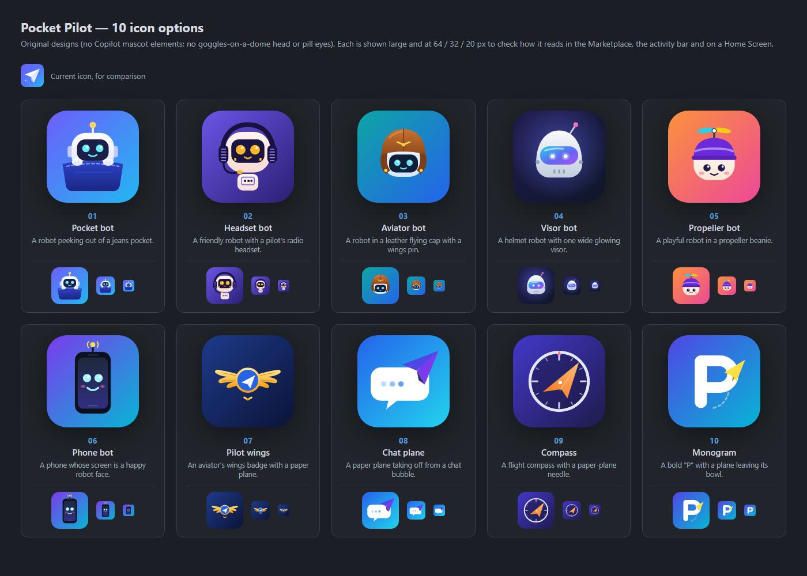

# Icon options

Ten original icon concepts for Pocket Pilot. Open [`index.html`](index.html) in a browser for the interactive gallery, or see the overview below. Every option is shown large and at 64, 32 and 20 px, because the icon has to read in the Marketplace, on a phone's Home Screen and as a favicon.

The designs deliberately avoid the GitHub Copilot mascot (a dome-shaped head with goggles pushed up and pill-shaped eyes), which is a trademark.

| # | File | Idea |
|---|------|------|
| 01 | [01-pocket-bot.svg](01-pocket-bot.svg) | A robot peeking out of a jeans pocket: "your agent, in your pocket". |
| 02 | [02-headset-bot.svg](02-headset-bot.svg) | A friendly robot with a pilot's radio headset and mic. |
| 03 | [03-aviator-bot.svg](03-aviator-bot.svg) | A robot in a leather flying cap with a gold wings pin. |
| 04 | [04-visor-bot.svg](04-visor-bot.svg) | A helmet robot with one wide, glowing visor. |
| 05 | [05-propeller-bot.svg](05-propeller-bot.svg) | A playful robot in a propeller beanie. |
| 06 | [06-phone-bot.svg](06-phone-bot.svg) | A phone whose screen is a happy robot face. |
| 07 | [07-pilot-wings.svg](07-pilot-wings.svg) | An aviator's wings badge with a paper plane in the medallion. |
| 08 | [08-chat-plane.svg](08-chat-plane.svg) | A paper plane taking off from a chat bubble. |
| 09 | [09-compass.svg](09-compass.svg) | A flight compass whose needle is a paper plane. |
| 10 | [10-monogram.svg](10-monogram.svg) | A bold "P" with a paper plane leaving its bowl. |

Once one is chosen, it becomes the app icon (`pwa/icons/icon.svg` plus the generated PNGs, maskable and Home Screen variants, favicon), the extension icon (`media/icon.png`, 128 px PNG for the Marketplace) and a simplified single-colour glyph for the VS Code activity bar (`media/activity.svg`).
